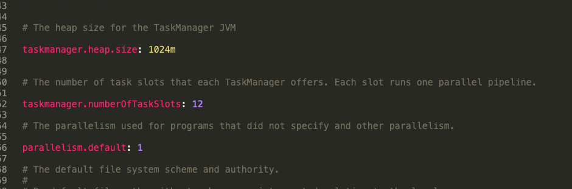

参考：https://www.cnblogs.com/rossiXYZ/p/13554085.html

https://ci.apache.org/projects/flink/flink-docs-release-1.11/zh/concepts/flink-architecture.html

https://ci.apache.org/projects/flink/flink-docs-stable/concepts/flink-architecture.html#task-slots-and-resources


# 从 Slot 的角度看系统划分

## Flink cluster 架构简析

从 Job 到 Task 运行的大致过程：

```
                                                                                        +--------------+
                                                                                        | +----------+ |
+--------+          +--------+         +---------+              +---------+             | |Task Slot | |
| Flink  |  Submit  |  Job   | Submit  |  Job    | Submit Task  |  Task   |Execute Task | +----------+ |
|Program +--------->+ Client +-------> | Manager +------------->+ Manager +------------>+              |
+--------+          +--------+         +---------+              +---------+             | +----------+ |
                                                                                        | |Task Slot | |
                                                                                        | +----------+ |
                                                                                        +--------------+

```

可见是主要是三步：

Job client ——Job manager—— Task manager。而在运行的时候，task 是依附于某一个**具体的**slot 上的。

下面是相关的架构图：


1. 从整体来看，一个 Flink cluster 是由一个 Flink master 和许多个 Task manager 组成的。而一个 Flink master 是由一个 Resource Manager 和多个 Job Manager 组成的。
   1. Job 层面的管理——Job Manager。
      1. Job manager 之中的 Scheduler 负责调度执行该 Job 的 DAG 之中的所有task，作为资源调度的起点来发送资源请求。
      2. Job manager之中的 Slot Pool 负责分配到该**job** 的所有资源。注意，还没有具体的 task 分配。
   2. 负责和外界资源调度系统的沟通——Resource Manager。外部调度系统主要指的是 K8s，yarn这种。
   3. 负责task的执行——task manager。**slot 是 task manager 资源的一个子集，也是 flink 资源管理的基本单位**。
2. 进程级别组件：flink master 和 task manager。其他的全是线程级别。

## Slot和 Resource

上面说到了，task manager 是一个JVM 进程，其可以在独立的线程之中执行一个或者多个 subtask。那么为了在 task manager 接受多个 task 的时候资源的分配，就有了 task slot 来进行控制。**task slot 在 task manager 之中至少一个。**

task slot 代表什么？代表着 **task manager**拥有资源的一个**子集**。如果一个 task manager 有三个 slot，那么每个 slot 都会有1/n 的资源。但是和memory 不同的是，slot 对于 cpu 资源是共享的，没有隔离开来。

为什么要将资源用 slot 分隔开？这样每个子任务就不会和其他任务因为分配内存而竞争，提高了程序的效率。

> 为什么不分隔CPU？
>
> 个人认为 CPU 时间不好量化，而且多核 CPU 可以通过提高并行度来将其利用率升高，而某个 subtask 独占CPU核并没有什么意义，反而起不到”并发"的作用。

同一个 JVM 之中的多个 slot 意味着这些 slot 之中的 subtasks 可以共享这个进程的 TCP 连接，heartbeat，那么就能够减少一些数据的网络传输，也能共享一些数据结构，一定程度减少了 task 的消耗。

>  为什么 task slot 是线程级别?
>
> 个人观点：
>
> task slot 要不就是子进程，要不就是线程。而子进程，其实资源和父进程几乎没关系，所以想要让 task manager 可以统筹其**内部**的内存分配，就只能将 slot 作为线程级别设计。

一个 slot 之中只能接受一个 subtask 嘛？不是。只要这些 subtask 是来自于同一个job，哪怕不是来自于同一个 task，也可以共享。这种情况下，一个 slot 甚至可以有一整条的 job 的 pipeline。slot sharing 有两点主要的好处：

1. 只要计算任务之中的最高并行度就好了，将 slot 设置成和最高并行度相同，不用去管有多少个任务。相当于把一个蛋糕竖着切，每一片都有完整的所有层， 不需要去考虑一共有多少层。
2. 容易获得更高的资源利用率，避免有些 slot 因为 task 偏后而闲置。

考虑下面的这个任务：


如果没有slot sharing，那么其 slot 的分配应当如下：


可以看到其实 keyBy()这一个需要等到 source()-->map() 结束之后才可以开始，但是因为没有 sharing，必须把这一步的 task 拆出 slot 容纳。那么这些 slot 其实在第一步就是闲置了。而开启 slot sharing 之后，就变成了：


可以看到其并行度显著增加。

### Slot 数量分配和 task manager 的动态分配

Slot 的内存是平均分配的，所以 slot 过多会导致 subtask 直接将内存撑爆出现OOM。如果内存充足的情况下，我们为了让 slot 之间不抢 CPU，可以按照 CPU 核数来分配 slot的数量。

如果我们开启了（默认开启）slot sharing，JobManager 在拿到执行计划之后，只要看并行度最高的算子就可以了。

- 在 standalone 模式下，task manager 的数量是固定的。可以在 flink-conf 之中对其相关属性进行配置：



- 在 k8s，yarn 等模式部署下，task manager 的数量则是 slot manager 核 resource manager（位于 Flink master 之中）来动态决定的。当前 slot 数量不足以满足 slot request 的时候，申请并且启动**新的 task manager。**如果 task manager 空闲一段时间之后，超时释放。

> 小问题：
>
> 不同的 task manager 之中会有不同 task 的 subtask嘛？会有不同 job 的 task 嘛？
>
> 会有属于同一个 job 的不同 task，自然也有属于它们的 subtask。但是不会有不同 job 的 task。——不同 job 的 task 没有任何需要串联优化资源的必要，所以不可能出现在同一个 task manager 之中

# Slot 分类

## Task manager 范畴

1. task slot：task manager 之中关于 slot 的基本定义，可以看出其主要包括：

   1. 分配给哪个 job
   2. 在这个 slot 之中运行的 task
   3. 资源管理器
   4. slot 状态

   而资源隔离，就是通过 memory manager 完成的。其原理是通过**要管理的内存总量**和**每个内存页的大小**得到内存页的数量，生成相应数量的内存页来作为可以使用的内存。从这里可以看出，平均划分更多是调度上面的考虑，而非是某个地方必须定死的标准。

   ```java
   // Container for multiple {@link TaskSlotPayload tasks} belonging to the same slot. 
   public class TaskSlot<T extends TaskSlotPayload> implements AutoCloseableAsync {
   
      /** Index of the task slot. */
      private final int index;
   
      /** Resource characteristics for this slot. */
      private final ResourceProfile resourceProfile;
   
      /** Tasks running in this slot. */
      private final Map<ExecutionAttemptID, T> tasks;
   
      private final MemoryManager memoryManager; // 物理资源隔离
   
      /** State of this slot. */
      private TaskSlotState state;
   
      /** Job id to which the slot has been allocated. */
      private final JobID jobId;
   
      /** Allocation id of this slot. */
      private final AllocationID allocationId; // 这个是在 SlotPoolImpl # requestSlotFromResourceManager 中生成的。
   
      /** The closing future is completed when the slot is freed and closed. */
      private final CompletableFuture<Void> closingFuture;
       
   	public SlotOffer generateSlotOffer() {
   		return new SlotOffer(allocationId, index, resourceProfile);
   	}    
   }  
   ```

   是谁发出的分配 slot 的请求？是 Resource manager 向 task manager 发出的。task manager 在分配完成 slot 之后会更新 `taskSlotTableImpl`**内部变量**。taskslot runtime 的快照如下：

   ```java
   taskSlot = {TaskSlot@12027}
    index = 0
    resourceProfile = {ResourceProfile@5359} "ResourceProfile{managedMemory=128.000mb (134217728 bytes), networkMemory=64.000mb (67108864 bytes)}"
    tasks = {HashMap@18322}  size = 0
    memoryManager = {MemoryManager@18323} 
    state = {TaskSlotState@18324} "ALLOCATED"
    jobId = {JobID@6259} "c7be7a4944784caac382cdcd9e651863"
    allocationId = {AllocationID@6257} "20d50091f2d16939f79f06edf66494f7"
    closingFuture = {CompletableFuture@18325} "java.util.concurrent.CompletableFuture@1ec6b32[Not completed]"
   ```

2. slotOffer

   当 task manager 分配好 taskSlot 之后，就会调用`generateslotOffer` 来生成一个 slotOffer，再返回给 Job master。其内部结构非常简单，就是一个中间变量，用来传递分配信息的。

   ```java
   /**
    * Describe the slot offering to job manager provided by task manager.
    */
   public class SlotOffer implements Serializable {
   	/** Allocation id of this slot, this would be the only identifier for this slot offer */
   	private AllocationID allocationId;
   
   	/** Index of the offered slot */
   	private final int slotIndex;
   
   	/** The resource profile of the offered slot */
   	private final ResourceProfile resourceProfile;
   }
   ```

   

   ## Job Manager 范畴

   

   JM 内部关于 Slot 的类大致如下：

   **物理Slot——SlotPool 之中管理的都是物理 Slot**

   org.apache.flink.runtime.jobmaster.slotpool.PhysicalSlot extends SlotContext

   org.apache.flink.runtime.jobmaster.slotpool.AllocatedSlot implements PhysicalSlot

   **分享Slot**

   org.apache.flink.runtime.jobmaster.slotpool.SlotSharingManager.TaskSlot

   org.apache.flink.runtime.jobmaster.slotpool.SlotSharingManager.MultiTaskSlot

   org.apache.flink.runtime.jobmaster.slotpool.SlotSharingManager.SingleTaskSlot

   **逻辑Slot**

   org.apache.flink.runtime.jobmaster.LogicalSlot

   org.apache.flink.runtime.jobmaster.slotpool.SingleLogicalSlot implements LogicalSlot, PhysicalSlot.Payload

1. 物理 Slot

   一个 task manager 的 taskSlot 对应一个 slotOffer，RPC 这个 slotOffer 给 JobMaster，jobMaster 再根据这个 SlotOffer 生成一个 AllocatedSlot，这样就建立起来了逻辑上面的 taskSlot 和SlotPool 之中的物理 Slot 的关联。

2. 分享 Slot（slotSharing）

   以下三个都是 在 SlotSharingManager 内部定义的。在 SlotSharingManager 和 Scheduler 中都有涉及，在某种程度上，可以认为是 物理 Slot 和 Logical 的一个中间状态。

   - org.apache.flink.runtime.jobmaster.slotpool.SlotSharingManager.TaskSlot
   - org.apache.flink.runtime.jobmaster.slotpool.SlotSharingManager.MultiTaskSlot
   - org.apache.flink.runtime.jobmaster.slotpool.SlotSharingManager.SingleTaskSlot

   SlotSharingManager 负责管理 slot sharing，slot sharing允许不同task在同一个slot中运行以实现co-location constraints。

   SlotSharingManager 允许建立一颗 TaskSlot hierarchy树。

   hierarchy树具体由 MultiTaskSlot 和 SingleTaskSlot 来实现，MultiTaskSlot代表树的中间节点，其包括一系列其他的TaskSlot，而SingleTaskSlot代表叶子节点。

   当 JM 生成一个 物理Slot，即 AllocatedSlot 之后，会 回调 一个 Future 2（代码在 SingleTaskSlot 构造函数，回调函数的输入参数是 SlotContext ），因为有 PhysicalSlot extends SlotContext， **所以 SingleTaskSlot 这里就把 物理Slot 映射成了一个 逻辑Slot ： SingleLogicalSlot**。

3. 逻辑 Slot

   回调函数会带着SingleLogicalSlot这个逻辑 slot 继续调用，这一步就是分配资源阶段了

SingleLogicalSlot 实现了 LogicalSlot。其成员变量 SlotContext slotContext; 实际指向了对应的AllocatedSlot，也就是指向了对应的物理 slot

```java
/**
 * Implementation of the {@link LogicalSlot} which is used by the {@link SlotPoolImpl}.
 */
public class SingleLogicalSlot implements LogicalSlot, PhysicalSlot.Payload {

   private final SlotRequestId slotRequestId;

   private final SlotContext slotContext;  // 这里实际指向了对应的AllocatedSlot

   // null if the logical slot does not belong to a slot sharing group, otherwise non-null
   @Nullable
   private final SlotSharingGroupId slotSharingGroupId;

   // locality of this slot wrt the requested preferred locations
   private final Locality locality;

   // owner of this slot to which it is returned upon release
   private final SlotOwner slotOwner;

   private final CompletableFuture<Void> releaseFuture;

   private volatile State state;

   // LogicalSlot.Payload of this slot
   private volatile Payload payload;
}   
```

## Resource manager 范畴

RM的组件 SlotManagerImpl 使用 TaskManagerSlot。

当 task manager 启动或者利用心跳机制来传递状态变化的时候，task manager 就会向 resource manager 来注册 slot 或者发送 slot 报告。注意，slot 信息是 task manager 产生并且主动向 resource manager 传递的。

RM（SlotManagerImpl ）会 相应 update 自己内部TaskManagerSlot的状态。 TaskManagerSlot 和 TM的 TaskSlot 是一一对应的。也就是说，每一个taskmanagerSlot 都会对应一个 taskSlot

```java
/**
 * A TaskManagerSlot represents a slot located in a TaskManager. It has a unique identification and
 * resource profile associated.
 */
public class TaskManagerSlot implements TaskManagerSlotInformation {

	/** The unique identification of this slot. */
	private final SlotID slotId;

	/** The resource profile of this slot. */
	private final ResourceProfile resourceProfile;

	/** Gateway to the TaskExecutor which owns the slot. */
	private final TaskExecutorConnection taskManagerConnection;

	/** Allocation id for which this slot has been allocated. */
	private AllocationID allocationId;

	/** Allocation id for which this slot has been allocated. */
	@Nullable
	private JobID jobId;
} 	
```